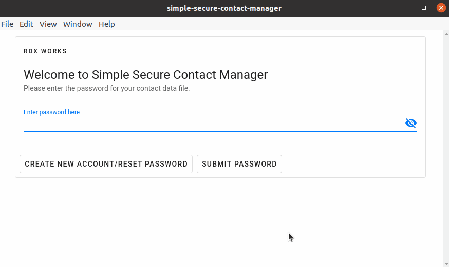

# Simple Secure Contact Manager

## About

The Simple Secure Contact Manager allows a user to securely manage their contact list.

## Application Overview

### Demo



### Features

- Reset encryption password
- Add new contact
- Update existing contact
- Lookup a specific contact via its information

### User Interface

The user interface for this project is powered by

- Electron: https://www.electronjs.org/
- VueJS: https://vuejs.org/
- Vuetify: https://vuetifyjs.com/en/

#### The following commands were run to generate the stub code for ElectronJS/Vue/Vuetify

```bash
npm install -g @vue/cli
vue create simple-secure-contact-manager
vue add vuetify
vue add electron-builder
```

### Encryption

The contact data is encrypted using the `crypto.js` implementation of the AES 192 CBC encryption algorithm with a randomly generated IV and utilizing a
SHA25 hash of the user's password as the encryption key.

## Code Pattern

### Domain Driven Design (DDD)

We are utilizing a DDD style approach for the code pattern in this project.

DDD focuses on converting the business requirements of the application into models that can be used by multiple layers
of application code.

We have 3 layers: `Domain`, `Infra`, and `Service`.

#### Domain

The Domain layers holds models and use cases which represent real life concepts and actions.

A domain model aims to codify a real life object.

A domain use case aims to codify a use case involving a particular domain model.

#### Infra

The Infra layer allows us to use domain models to interact with the infrastructure layer.

A repository provides an abstraction for performing infrastrucutre operations in terms of domain models. For example, we
can store and retrieve `ContactList` models to disk using the `LocalFileContactListsRepository`.

#### Service

The Service layer contains the application code which interacts with the Infra & Domain layers. In our case, the Service
layer is where ElectronJS/VueJS lives.

### File Conventions

- filenames: kebab-case
- folder names: kebab-case
- test cases:
    - FILENAME.unit.ts
    - FILENAME.integration.ts

## Running the app

### Project setup

#### Datafile Path

By default, the datafile will be saved to your home directory as `radix_data_file`.

Alternatively, the path can be overridden in `src/configs/config.json` with the `customDatafilePath` field.

Example: `"customDatafilePath": "~/custom_path_radix_data_file"`

#### Install Dependencies

```
yarn install
```

#### Compiles and hot-reloads for development

```
yarn electron:serve
```

#### Compiles and minifies for production

```
yarn electron:build
```

#### Creating Default Account & Contacts

If you want to create a default account with 20 pre-generated contacts, run the following
`yarn setup-default-account`. The account will be created with the password `Password1234!`

#### Tests

To run the jest test suite run
`yarn test`
